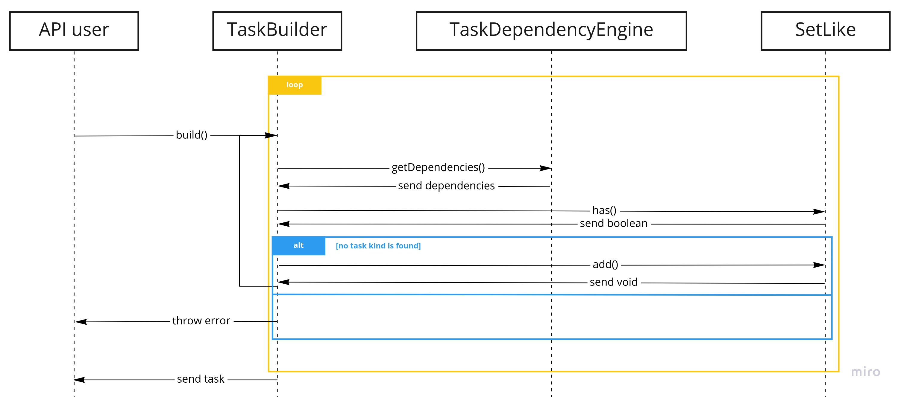

# The big picture

We've talked about managing tasks but, what are the expections of the task manager?

Basically:

1. It allows you to create a task. The task manager should compose the task and any other dependent tasks.

2. It allows you to run the task. All the dependent tasks should be run in a right order.

## Task build

First of all, tasks have kinds. You are free to create task kinds as you want, just keep in mind:

- It's mandatory to create custom task kinds. Be smart designing your task kinds, keep in mind any task has (only) these inputs:
    - Dependent tasks output.
    - Its kind.
- A `SetLike` implementation should be provided in order to detect circular dependencies. This means `SetLike` implementation should check for deep equality of your task kinds.
- A class implementing `TaskDependencyEngine`. The purpose of this module is to provide the task dependencies kind given a task kind.
- A class extending `DependentTaskBuilder` which uses a `SetLike` and a `TaskDependencyEngine` should be created in order to build tasks.

## Task run

Once a dependent task is built, it can be easily run using a `DependentTaskRunner` instance. Keep in mind that **any** asyncronous task dependency forces a dependent task execution to be asyncronous.

Would you like to know how to create your own task manager? Allow me to introduce you to some basic concepts: [task](./3-about-tasks), [task dependency engine](./4-about-task-dependency-engines)
